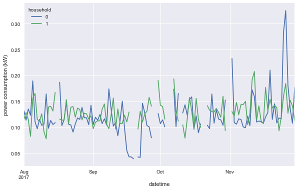

# elec_consumption


## 1. Introduction

There are 500 time series spanning 122 days (Aug 1, 2017 to Nov 30, 2017).

Preview first five rows for first five households. Unit is presumed to be kV.


<div>
<style scoped>
    .dataframe tbody tr th:only-of-type {
        vertical-align: middle;
    }

    .dataframe tbody tr th {
        vertical-align: top;
    }

    .dataframe thead th {
        text-align: right;
    }
</style>
<table border="1" class="dataframe">
  <thead>
    <tr style="text-align: right;">
      <th>household</th>
      <th>0</th>
      <th>1</th>
      <th>2</th>
      <th>3</th>
      <th>4</th>
    </tr>
    <tr>
      <th>datetime</th>
      <th></th>
      <th></th>
      <th></th>
      <th></th>
      <th></th>
    </tr>
  </thead>
  <tbody>
    <tr>
      <th>2017-08-01 00:00:00</th>
      <td>0.094</td>
      <td>0.028</td>
      <td>0.116</td>
      <td>0.096</td>
      <td>0.189</td>
    </tr>
    <tr>
      <th>2017-08-01 00:30:00</th>
      <td>0.039</td>
      <td>0.050</td>
      <td>0.068</td>
      <td>0.077</td>
      <td>0.156</td>
    </tr>
    <tr>
      <th>2017-08-01 01:00:00</th>
      <td>0.088</td>
      <td>0.060</td>
      <td>0.044</td>
      <td>0.095</td>
      <td>0.118</td>
    </tr>
    <tr>
      <th>2017-08-01 01:30:00</th>
      <td>0.046</td>
      <td>0.023</td>
      <td>0.067</td>
      <td>0.092</td>
      <td>0.145</td>
    </tr>
    <tr>
      <th>2017-08-01 02:00:00</th>
      <td>0.082</td>
      <td>0.020</td>
      <td>0.068</td>
      <td>0.085</td>
      <td>0.153</td>
    </tr>
  </tbody>
</table>
</div>


Power consumption profiles of household 0, 1, 2 on Aug 1, 2017 are plotted:


Here is the hourly down-sampled averaged profile of 0 on Aug 1, 2017. It is compared to the original profile.


## 2. Daily Down-Sampled Averaged Profiles

Here are daily down-sampled averaged profiles of households 0 and 1 for the whole period. There are some days when there is no entries. Such missing entries are discussed in the following section.





Entries in Aug, 2017 are zoomed in.


## 3. Handle Missing Entries

- For households 162, 428 and 432, two entries in different sets of dates are missed".
- For all the other households, 48 entries in different sets of dates are missed.


`NaN` values can be filled with 0, but it will distort clustering.

```python
# There are only 186 rows having complete data.
assert df.dropna(axis=0).shape[0] == 186
```

~~It seems that two sets of missing days corresponding to any pair of households (except 162, 428, 432) are differentiated by 1 dates.~~

Linear interpolation is not very useful.


